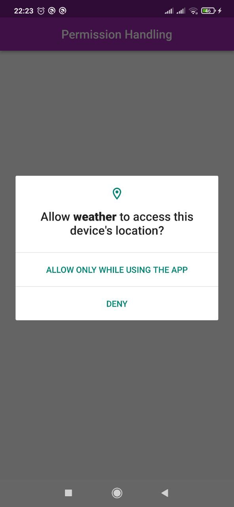
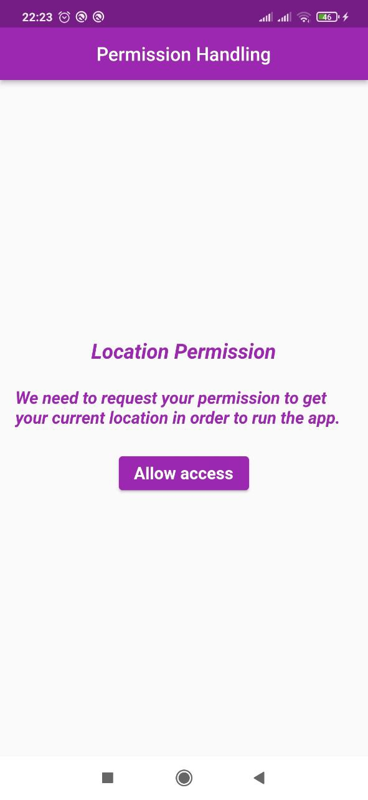
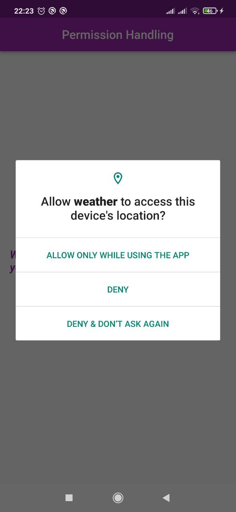
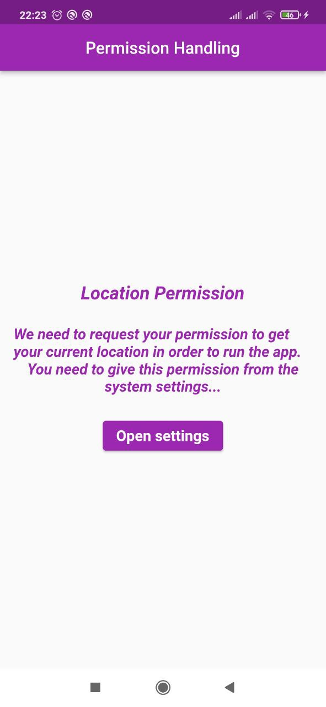
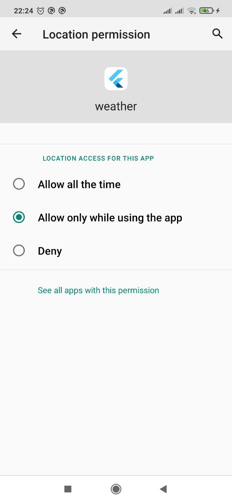
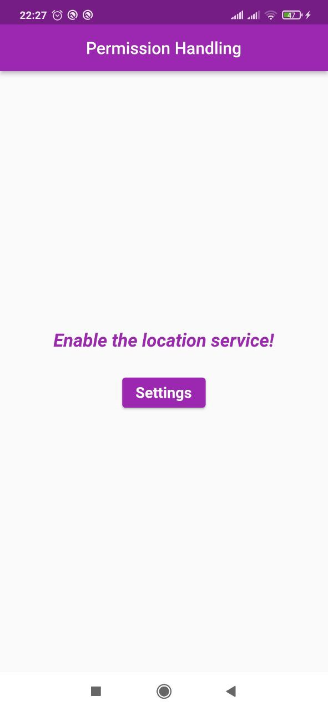
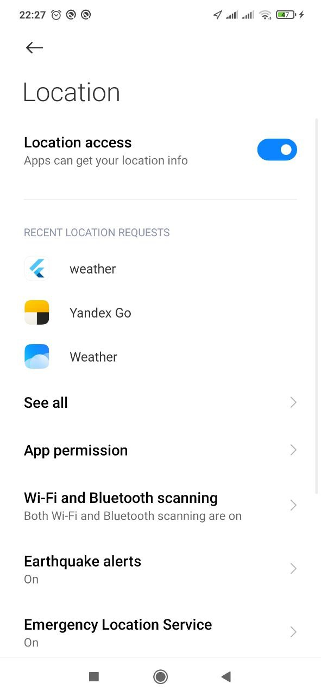
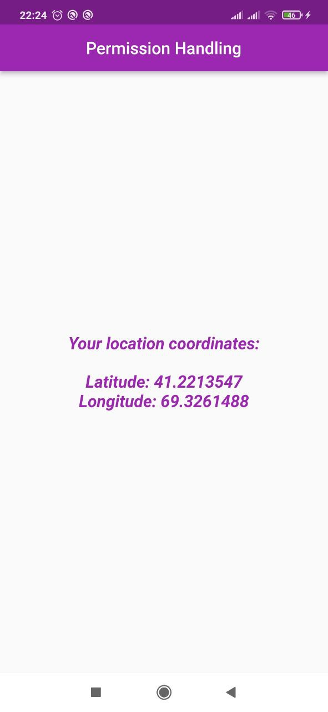

# ```Location Permission Handling```

| Permission request #1 | Denied | Permission request #2 |
|----------------|:----------------:|:----------------:|
|  |  |  |

| Permanently denied | Grant | Location Service Disabled |
|----------------|:----------------:|:----------------:|
|  |  |  |


| Enable Location Service | Location Data |
|----------------|:----------------:|
|  |  |


### Geolocator Package
1. Android
   For android at "android/app/src/main/AndroidManifest.xml" before the application tag.
   (Internet permissions do not affect the `permission_handler` plugin but are required if your app needs access to the internet)
   (Starting from Android 10 you need to add the ACCESS_BACKGROUND_LOCATION permission)

    <uses-permission android:name="android.permission.INTERNET" />

   (Permissions options for the `location` group)
   <uses-permission android:name="android.permission.ACCESS_FINE_LOCATION" />
   <uses-permission android:name="android.permission.ACCESS_COARSE_LOCATION" />
   <uses-permission android:name="android.permission.ACCESS_BACKGROUND_LOCATION" />

2. IOS
   For ios, in "ios/Runner/Info.plist", add the following settings in the end of dict tag.
    <!-- Permissions list starts here -->
        <!-- Permission while running on backgroud -->
        <key>UIBackgroundModes</key>
        <string>location</string>
        <!-- Permission options for the `location` group -->
        <key>NSLocationWhenInUseUsageDescription</key>
        <string>This app needs access to location when open.</string>
        <key>NSLocationAlwaysAndWhenInUseUsageDescription</key>
        <string>Always and when in use!</string>
        <key>NSLocationUsageDescription</key>
        <string>Older devices need location.</string>
        <key>NSLocationAlwaysUsageDescription</key>
        <string>This app needs access to location when in the background.</string>
        <!-- Permission options for the `appTrackingTransparency` -->
        <key>NSUserTrackingUsageDescription</key>
        <string>appTrackingTransparency</string>
    <!-- Permissions lists ends here -->


### Permission Handler

1. Android
   For android on "android/gradle.properties" add these settings if it's already not there.
   android.useAndroidX=true
   android.enableJetifier=true

   On "android/app/build.gradle" change compiled SDK version to 31 if you haven't already.

   android {
   compileSdkVersion 31
   ...
   }

2. IOS
   We've already added permissions on info.plist already.


- #### [Flutter Geolocator Plugin](https://pub.dev/packages/geolocator)
- #### [Permission Handler](https://pub.dev/packages/permission_handler)
